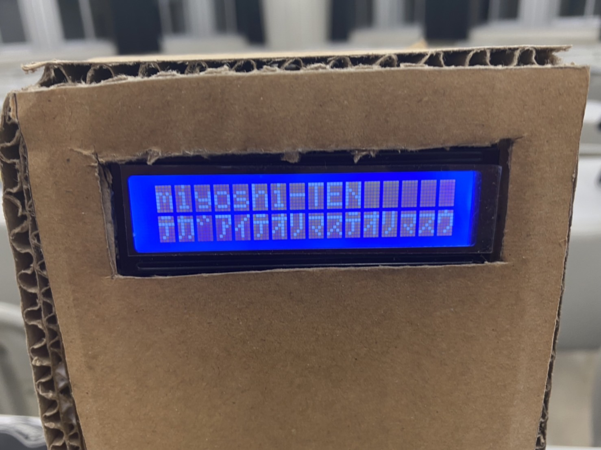
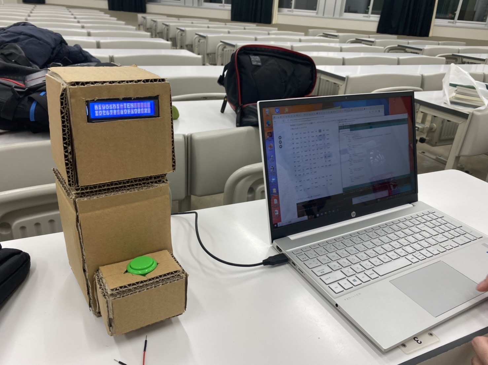
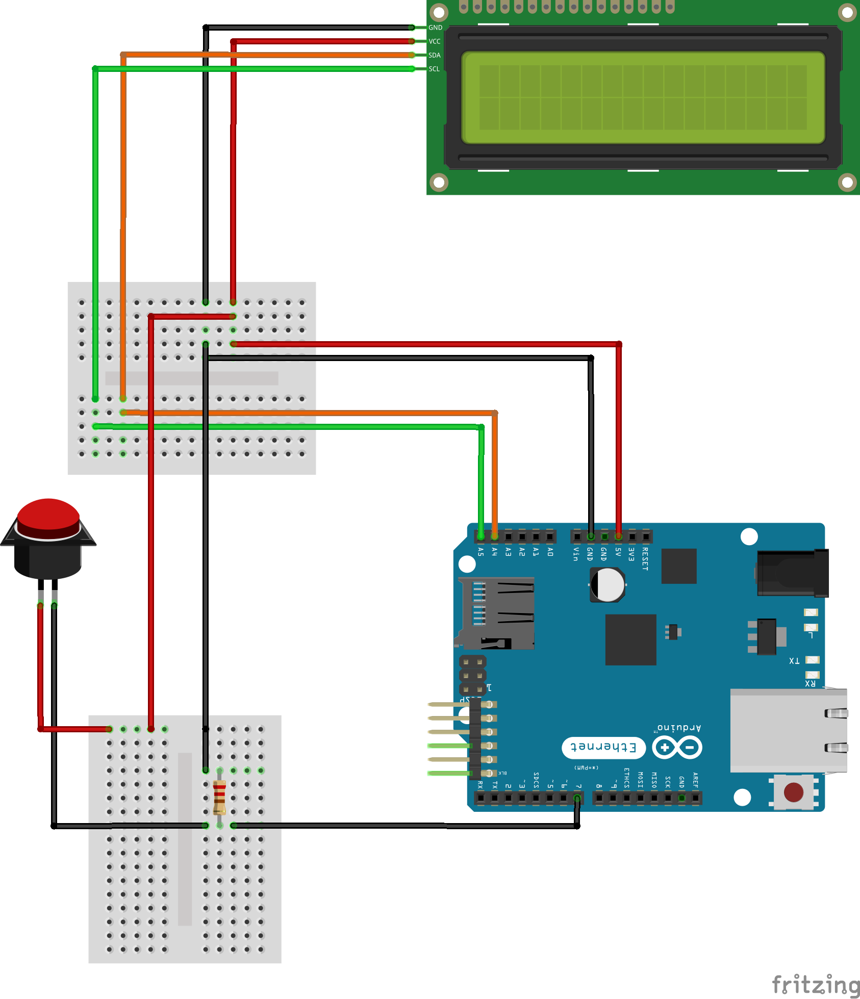

<h1>技術課程第二 グループワーク活動</h1>
<h2>プロジェクト題名: NANISHI-TEN ～相互理解を深めるプロダクト提案～</h2>

<!-- NANISHI-TEN 説明 -->

組織行動において、チームメンバがどんな作業を行っているのかが不明確なため、組織の中で相互不信が発生すると考えた.そこで、我々のチームでは（技術課程演習第二のグループワーク活動にて)、組織におけるコミュニケーション支援ツール(NANISHI-TEN)を提案した.提案内容に対する目的としては、小型ロボット(NANISHI-TEN)による作業者の作業情報を可視化することで周囲の作業者に作業に対する相互理解を促すことを目的とした.検証結果としては、作業情報が可視化されたことによって、組織におけるコミュニケーションの相互不信改善につながった.

<!-- fig1 -->

<h3>
図1.1 NANISHI-TEN(プロトタイプ)</h3>

<!-- fig1に対する説明 -->

図1.1は実際に我々のチームが開発したコミュニケーション支援ツール(NANISHI-TEN)である.画像の中に映っているロボットのディスプレイ(LCD)上に作業者の作業情報が表示されている.これにより作業者がどんな作業を行っているのかを周囲の作業者が知ることができる.

<!-- fig2 -->

<h3>
図1.2 全体像NANISHI-TEN(プロトタイプ)</h3>

<!-- fig2に対する説明 -->

図1.2はNANISHI-TENの全体像の写真である.システムとしては作業者のPCからNANISHI-TEN Applicationを立ち上げ、applicationの操作から周囲に知らせたい作業内容を送信する.そして送信されたデータはUSBケーブルを通過してArduinoで処理され、NANISHI-TENディスプレイ上に送信内容が表示される仕組みになっている.また、NANISHI-TENの腹部にある緑色のボタンを押すと作業に対する『良いね！！』が付き、作業者のモチベーションの向上も期待される。

<!-- fig3 -->

<h3>
図1.3 Arudino回路図</h3>

<!-- fig3に対する説明 -->

図1.3はNANISHI-TEN(プロトタイプ)を組む上で採用したArduinoの回路図である.基本的にこれと同じ回路を組み、ソフトウェア/SerialPortからC# Applicationをダウンロードしてexeファイルを実行すればNANISHI-TENを動作させることができる.

